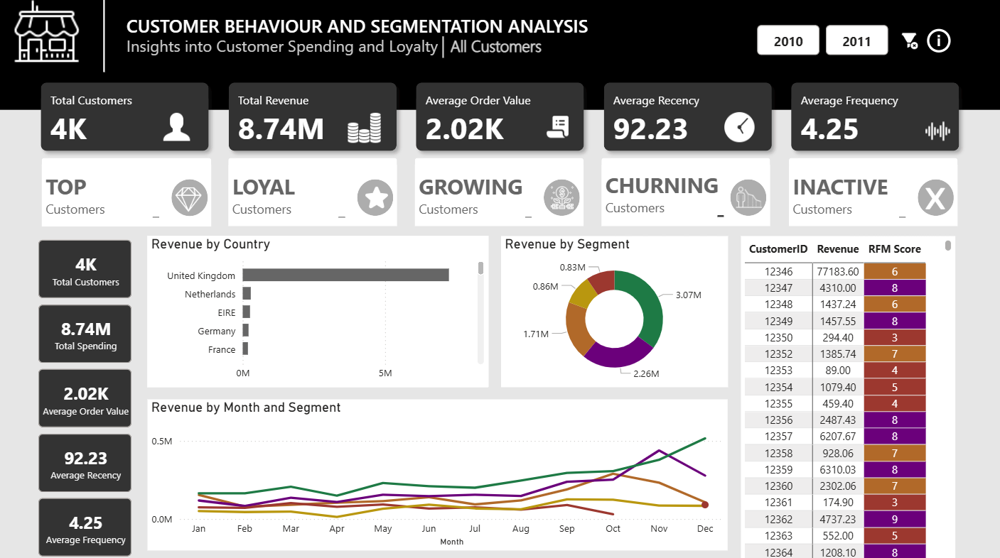
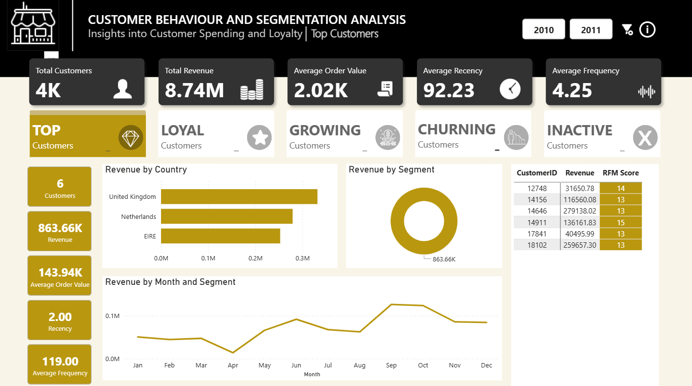
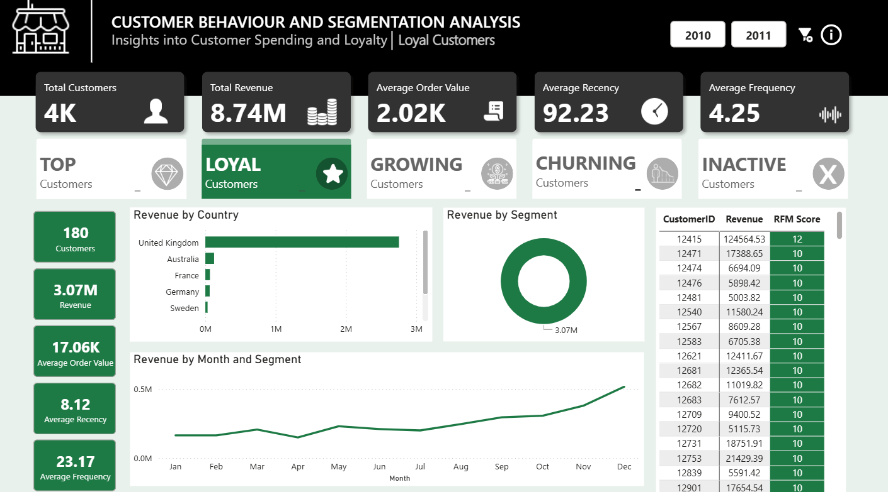
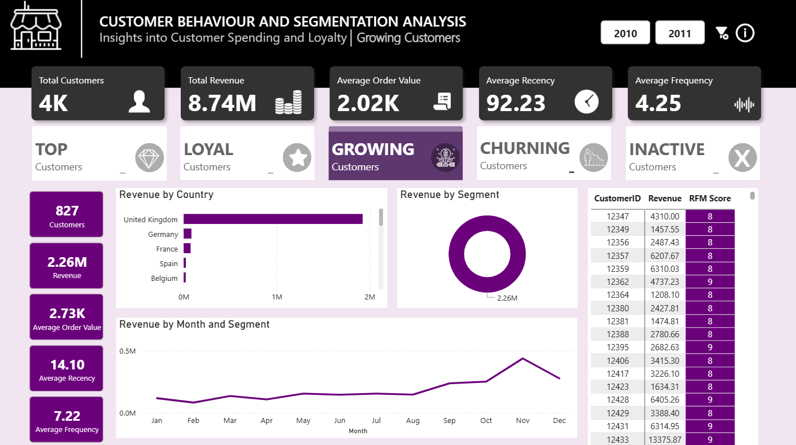
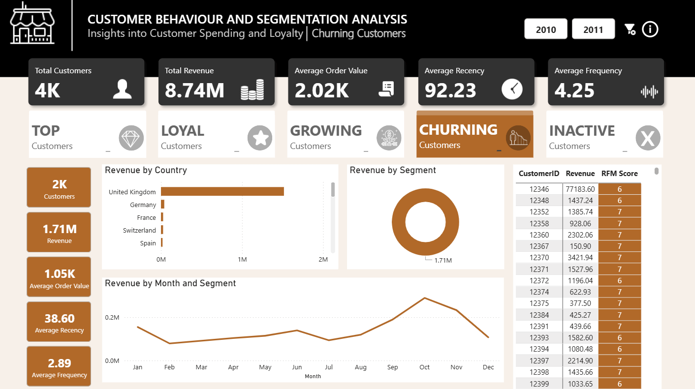
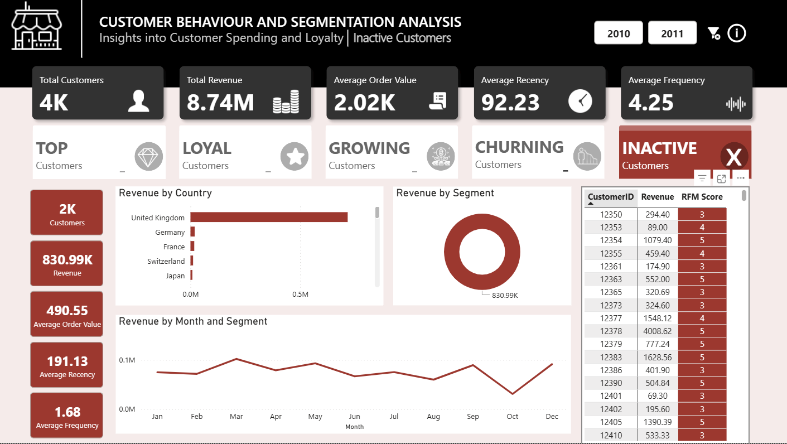

<!-- PROJECT HEADER -->
<h1 align="center">📊 CUSTOMER BEHAVIOUR & SEGMENTATION ANALYSIS</h1>
<p align="center">
  <code>Power BI</code> <code>Excel</code> <code>Data Analysis</code> <code>Dashboard</code>
</p>


<p align="center">
  <i>Insights into Customer Spending, Loyalty & Revenue Performance</i>
</p>

<p align="center">
  <!-- Badges -->
  
  
  
  
</p>

---

<!-- ANIMATED DIVIDER -->
<p align="center">
  
</p>

---

## 🚀 Overview

This project features a fully interactive **Customer Segmentation Dashboard** built in **Power BI**, providing clear insights into:

- 🧩 Customer behaviour  
- 💸 Revenue distribution  
- 📆 Monthly trends  
- 🌍 Country performance  
- ⭐ RFM-based customer segmentation  

It’s built for **data-driven decision-making** and perfect for business intelligence use cases.

---

## 🖼 Dashboard Preview

<div align="center">

<!-- Row 1 -->




<!-- Row 2 -->




</div>


---

## 🎯 Key Features

### 🔹 **1. RFM Segmentation**
Customers categorized into:
- ⭐ Top  
- 💚 Loyal  
- 📈 Growing  
- ⚠️ Churning  
- ❌ Inactive  

### 🔹 **2. Revenue Insights**
- Total revenue  
- Segment revenue  
- Country revenue breakdown  

### 🔹 **3. Behaviour Metrics**
- Average order value  
- Frequency of purchases  
- Recency score  

### 🔹 **4. Time-Series Analysis**
- Monthly revenue  
- Seasonal trends  
- Segment performance over time  

---

## 📌 Business Insights

✔ **UK contributes the highest revenue** — core customer base  
✔ **Loyal customers are the backbone**, generating over 3M+  
✔ **Top customers are extremely high-value**, though few  
✔ **Seasonal revenue surge in Oct–Dec**  
✔ **Growing customers show strong conversion potential**  
✔ **Churning segment needs targeted reactivation**

---

## 🛠 Tech Stack

| Tool | Purpose |
|------|---------|
| **Excel** | Data Exploration |
| **Power BI** | Data transformation, Dashboard & visuals |
| **DAX** | RFM calculation + KPIs |
| **GitHub** | Documentation |

---


## 📂 Dataset Source  
📊 The dataset used for this project was sourced from **Kaggle**.

---
## 📁 Project Structure

```
📦 Customer-Segmentation-Dashboard
│
├── 📊 Customer Behavior and Segmentation Analysis.pbix
├── 📄 Customer Behavior and Segmentation Analysis.pptx
├── 📄 Datasets
├── 🖼 Assets
│   ├── 01_Total_preview.png
│   ├── 02_Top_preview.png
│   ├── 03_Loyal_preview.png
│   ├── 04_Growing_preview.png
│   ├── 05_Churning_preview.png
│   └── 06_Inactive_preview.png
└── README.md
```

---


## ▶️ How to Use

1. Download the **.pbix** file  
2. Open in **Power BI Desktop**  
4. Interact with segments & filters  

---

## 🌟 What You Learn from This Project

- Customer segmentation using RFM  
- Data storytelling through visuals  
- KPI design, analytics & interpretation  
- Dashboard design best practices  
- Business decision insights  

---

## 🤝 Contributions

Have suggestions or improvements?  
Feel free to fork this repo, open an issue, or submit a pull request.

---

## 📧 Contact
For collaborations or automation projects:  
📩 **Email:** [Email Me](mailto:musedikutemitope@gmail.com)  
💬 **WhatsApp:** [Chat on WhatsApp](https://wa.me/2348072240480)  
💼 **LinkedIn:** [Connect with me](https://www.linkedin.com/in/joshua-musediku-510945302)

---

## ⭐ If you found this project helpful, please give it a star!

---

## 🏷️ Tags
`customer-segmentation` `data-analysis` `dashboard` `power-bi` `excel` `business-intelligence` `customer-behavior` `data-visualization` `analytics`

---


